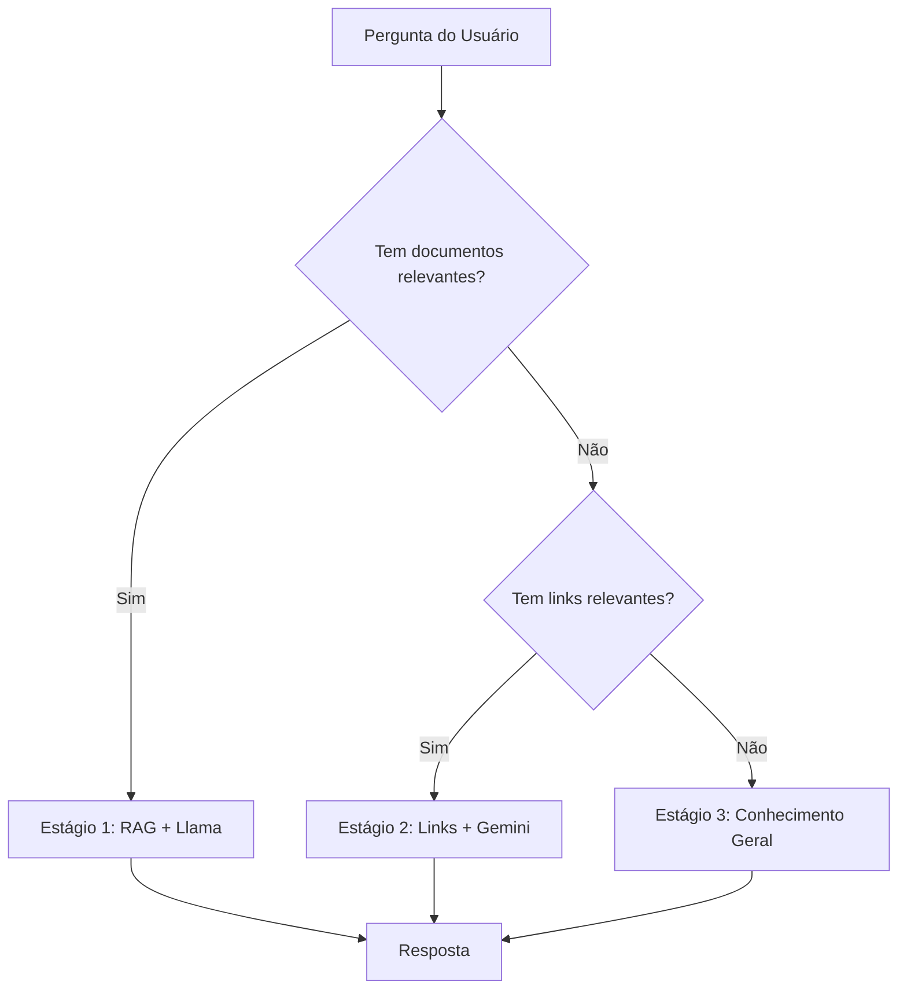

# 🚀 EDU SYSTEM - Sistema Híbrido de IA

Sistema educacional avançado com inteligência artificial híbrida em três estágios, desenvolvido com FastAPI e tecnologias modernas de IA.

## ✨ Funcionalidades Principais

### 🤖 Sistema de IA Híbrida (3 Estágios)
1. **Estágio 1 - RAG + Llama**: Busca em documentos com IA local
2. **Estágio 2 - Links + Gemini**: Processamento de links com IA na nuvem  
3. **Estágio 3 - Conhecimento Geral + Gemini**: Respostas de conhecimento geral

### 👥 Gestão de Usuários e Agentes
- Sistema de autenticação JWT
- Níveis de usuário (Admin, Global Admin, Master Admin)
- Criação e gerenciamento de agentes de IA
- Upload de logos personalizados para agentes

### 📚 Processamento de Conhecimento
- Upload de documentos PDF e TXT
- Processamento automático com ChromaDB
- Gerenciamento de links com web scraping
- Base de conhecimento vetorial

## 🏗️ Arquitetura Técnica

### Backend
- **FastAPI** 2.0.0 - Framework web moderno
- **SQLAlchemy** - ORM para banco de dados
- **SQLite** - Banco de dados local
- **JWT** - Autenticação segura

### IA e Processamento
- **Google Gemini** (gemini-1.5-flash) - IA na nuvem
- **Ollama + Llama3** - IA local para RAG
- **ChromaDB** - Banco vetorial para embeddings
- **BeautifulSoup4** - Web scraping

### Utilitários
- **Pillow** - Processamento de imagens
- **PyPDF2** - Extração de texto de PDFs
- **python-multipart** - Upload de arquivos

## 📊 Estrutura do Banco de Dados

### Tabelas Principais
- `users` - Usuários do sistema
- `agents` - Agentes de IA criados
- `documents` - Documentos enviados para RAG
- `links` - Links gerenciados pelos agentes

### Relacionamentos
```
User (1) -----> (N) Agent
Agent (1) -----> (N) Document
Agent (1) -----> (N) Link
```

## 🚀 Como Executar

### 1. Ativar Ambiente Virtual
```bash
.venv\Scripts\Activate.ps1  # Windows PowerShell
```

### 2. Iniciar Servidor
```bash
uvicorn main:app --reload --host 127.0.0.1 --port 8000
```

### 3. Acessar Sistema
- **API Docs**: http://localhost:8000/docs
- **ReDoc**: http://localhost:8000/redoc

## 🔐 Autenticação

### Usuário Padrão
- **Username**: `admin`
- **Password**: `admin123`
- **Role**: `MASTER_ADMIN`

### Endpoints de Autenticação
- `POST /login` - Login com username/password
- `POST /users` - Criar novo usuário (admin)

## 📋 Principais Endpoints

### Agentes
- `GET /agents` - Listar agentes
- `POST /agents` - Criar agente
- `GET /agents/{id}` - Obter agente específico
- `POST /agents/{id}/ask` - Fazer pergunta ao agente

### Upload e Recursos
- `POST /agents/{id}/upload` - Upload de documentos
- `POST /agents/{id}/logo` - Upload de logo
- `POST /agents/{id}/links` - Adicionar link
- `GET /agents/{id}/links` - Listar links

## 🎯 Sistema de IA - Fluxo de Decisão



## 📁 Estrutura de Arquivos

```
Backend/
├── main.py              # Aplicação principal FastAPI
├── models.py            # Modelos do banco de dados
├── schemas.py           # Schemas Pydantic
├── database.py          # Configuração do banco
├── auth.py              # Sistema de autenticação
├── edu.db              # Banco SQLite
├── static/             # Arquivos estáticos (logos)
├── uploads/            # Documentos enviados
└── chroma_db/          # Base vetorial ChromaDB
```

## 🔧 Variáveis de Ambiente

Certifique-se de configurar:
- `GOOGLE_API_KEY` - Chave da API do Google Gemini
- Ollama rodando localmente na porta 11434

## ✅ Status de Validação

- ✅ **100% dos testes passaram**
- ✅ **Sistema de 3 estágios funcionando**
- ✅ **Upload de documentos e processamento RAG**
- ✅ **Gerenciamento de links dinâmico**  
- ✅ **Upload de logos de agentes**
- ✅ **Autenticação e segurança**

## 🏆 Tecnologias Utilizadas

| Categoria | Tecnologia | Versão | Uso |
|-----------|------------|--------|-----|
| **Backend** | FastAPI | 2.0.0 | Framework web |
| **Database** | SQLAlchemy | Latest | ORM |
| **AI Cloud** | Google Gemini | 1.5-flash | IA na nuvem |
| **AI Local** | Ollama + Llama3 | Latest | IA local |
| **Vector DB** | ChromaDB | Latest | Embeddings |
| **Auth** | JWT | Latest | Autenticação |
| **Images** | Pillow | Latest | Processamento |

---

**Sistema desenvolvido e validado com sucesso! 🎉**

*Última atualização: Agosto 2025*
